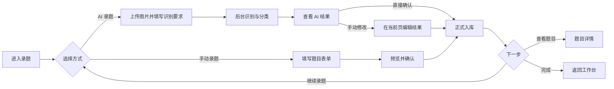
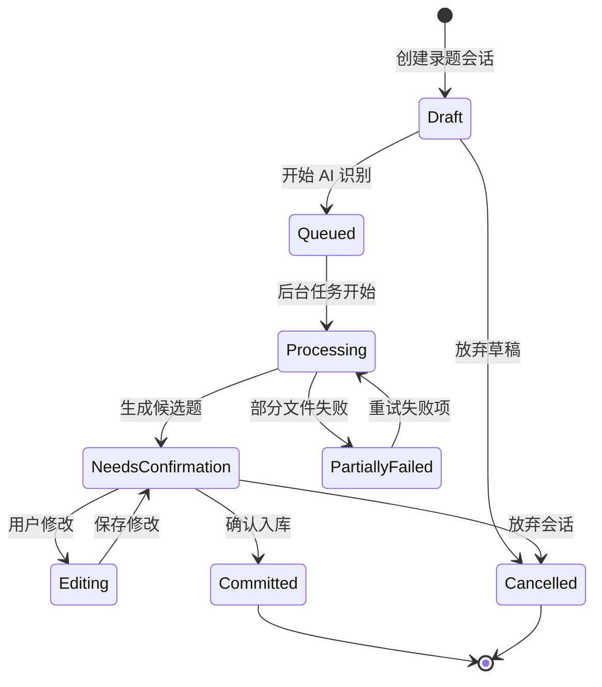

# 研错库 UI 与操作流程重构规划

> 状态：已确认方向；录题垂直切片及公式阅读/题目详情切片已实施，其余按本文继续推进。  
> 日期：2026-07-23  
> 本文最初用于确认产品逻辑；确认“开始执行”后，实施进度单独记录如下。

## 0. 实施进度（2026-07-23）

第一阶段已完成：

- 一级导航调整为工作台、录题、题库、复习、数据与同步、设置；独立 AI 一级页已移除；
- 新增 `ProblemIntakeService`，手动录题一次事务创建正式题目、标签、原图、版本和 Operation；
- 新增录题内部页面栈：方式选择、手动表单、AI 上传、后台进度、结果确认和完成页；
- AI 上传支持本批用户提示词，并自动附带现有科目/章节分类上下文；
- AI 结果在录题页内显示原图、不确定字段和可编辑表单，确认后直接进入正式题库；
- AI 任务离开录题页后继续运行，程序重启后可以发现并恢复最近未完成的录题任务；
- 题库默认只显示正式题目，AI 暂存记录进入显式“待整理 / 收件箱”；
- 原“AI 审核”统一改称“待确认变更”，保留给已有题目修改、工作区和同步冲突。

第一轮实际使用反馈中的阻断问题也已修复：

- AI 图片选择后立即显示大图预览与缩略图，不再只展示绝对路径；
- 回收站中的同哈希原图不再阻止重新录题，正式/收件箱/归档记录仍参与去重；
- 清空回收站会在同一事务中先清理 AI、审核和来源关联，再删除题目与图片记录；共享原图按剩余引用安全保留。
- AI 录题默认调用 Faro OpenAI 兼容接口；设置页可保存 Key、测试模型列表并持久化图片模型，Mock 只作为显式离线测试选项。

第二个体验切片已完成：

- AI 确认结果拆为“阅读预览 / 编辑字段”，公式先渲染后核对，字段修改会自动刷新阅读预览；
- 新增本地 LaTeX→MathML 渲染组件，AI 确认、题目详情和今日复习共用，不依赖在线 CDN；
- 题库双击题目或点击“打开详情”进入主内容区嵌套页，详情页集中展示原图、题干、答案、解析、错因和标签；
- 入库完成后的“查看题目”直接进入详情页，详情页支持返回题库与继续编辑；
- 公式渲染不改变数据库字段与跨端协议，继续保持 `schema_version=4`。

第一阶段为保持 `schema_version=4` 兼容，仍有以下过渡限制：

- AI 暂存记录暂时复用 `inbox` Problem，后续专用 intake 表落地后再彻底分离草稿和正式题目；
- 当前仍是一张图片生成一个候选题，一图多题需要下一次数据模型升级；
- 手动表单在本次程序运行中保留，尚未实现跨重启的持久草稿；
- 题库列表和部分旧流程仍使用整体刷新，局部模型更新将在后续阶段实施。

## 1. 我对问题的理解

当前程序的问题并不是单纯的“界面不够漂亮”，而是把内部功能模块直接暴露给了用户：

- 新建题目在题库页；
- 图片导入会先创建收件箱题目；
- AI 识别又需要先选择已有题目；
- 任务进度在独立任务中心；
- 结果还要进入另一个“AI 审核”窗口；
- 最终接受后才算完成入库。

用户想完成的是一个动作——“录入一道错题”，却被迫理解题库状态、AI 任务、审核会话和页面入口之间的关系。这是以技术模块为中心，而不是以用户任务为中心。

本次重构的核心不是继续增加入口，而是：

> 把“手动录题”和“AI 录题”封装成两条完整、连续、可恢复的工作流。用户只需选择目标，程序负责组织后续步骤。

## 2. 重构目标

### 2.1 用户体验目标

1. 新用户打开程序后，能够立即知道“从哪里开始”。
2. 从选择录题方式到最终入库，全程停留在“录题”模块内完成。
3. AI、后台任务、审核、草稿等内部概念不再要求用户跨页面自行串联。
4. 页面切换保留上下文，不通过反复清空列表和全局刷新制造跳动感。
5. 每个页面只突出一个主要任务，并明确当前步骤、处理状态和下一步操作。
6. AI 可以自动提取、分类和推荐标签，但正式入库前保留一次清晰的人工确认。

### 2.2 程序架构目标

1. 用统一的“录题工作流服务”封装图片导入、AI 任务、结果审核和正式入库。
2. UI 不再分别拼接 `AppServices`、`AIService`、任务中心和审核窗口。
3. 草稿、处理中结果和正式题目具有清晰边界，取消流程不会留下无意义的空题。
4. 页面使用局部状态更新和事件通知，不再依赖 `refresh_all()` 式全局刷新。
5. 后续可以在同一框架内扩展批量录题、手机收件箱和 PDF 页面拆题。

## 3. 产品组织原则

### 3.1 按用户任务组织，而不是按技术能力组织

- “AI”不是用户最终目标，因此不再作为一级导航。
- “审核”不是独立目的地，而是录题工作流的一个步骤。
- “任务中心”是辅助能力，只在状态区或通知中心提供入口。
- “数据、同步、备份”属于低频管理功能，与日常录题和复习分层展示。

### 3.2 页面层级替代大量弹窗

手动录题、AI 录题、结果确认和题目详情使用主内容区内的嵌套页面。弹窗只保留给：

- 确认不可逆操作；
- 选择本地文件或目录；
- 极短的单字段输入；
- 无法在当前流程中继续的错误说明。

### 3.3 “全自动”不等于“静默写库”

AI 录题中的全自动是指：程序自动完成文件保存、图像分析、题目拆分、字段提取、学科章节判断、标签推荐和重复检测，不要求用户中途操作。

正式写入题库前仍保留一次结果确认，原因是原始图片可能模糊，AI 也可能误判。用户可以直接确认，也可以在同一页面修改后确认，不需要跳转到其他模块。

## 4. 新的信息架构

建议一级导航调整为：

```text
工作台
录题
题库
复习
────────
数据与同步
设置
```

### 4.1 工作台

工作台不是功能按钮集合，而是“今天需要处理什么”：

- 新用户：显示“录入第一道错题”，直接选择手动或 AI；
- 继续上次未完成的录题；
- 显示正在后台识别的任务；
- 显示待确认的 AI 结果；
- 显示今日待复习数量；
- 显示最近入库题目。

工作台的作用是提供开始和继续任务的入口，不重复完整功能页面。

### 4.2 录题

这是本轮最重要的新模块，内部拥有自己的页面栈：

```text
录题首页
├── 手动录题
│   ├── 编辑表单
│   ├── 预览确认
│   └── 入库完成
└── AI 录题
    ├── 上传图片与输入要求
    ├── 后台识别进度
    ├── 结果确认 / 手动修正
    └── 入库完成
```

这些是同一模块的内部步骤，不进入左侧一级导航，也不要求用户跳转到“AI”或“审核”。

### 4.3 题库

题库只负责已经入库内容的浏览、筛选、编辑和批量操作。建议二级层次为：

- 全部题目；
- 最近入库；
- 收藏；
- 已归档；
- 回收站；
- 保存的筛选条件。

“AI 识别新题”和“导入图片创建题目”从题库页移出。对已有题目的 AI 补全可以保留为题目详情中的上下文操作，但不与新题录入混在一起。

### 4.4 复习

复习页只围绕复习任务：今日队列、复习过程、复习结果和历史统计。将题目加入复习仍可在题库中作为上下文操作，但开始和继续复习都在复习模块完成。

### 4.5 数据与同步

集中放置备份、恢复、导入导出、分享和云同步。页面内部按低频任务分组，不与日常题目录入混合。

### 4.6 设置

设置保留独立入口，但改为主内容区内的设置页。AI 提供商、模型和密钥属于设置，不再成为用户每次录题前必须访问的步骤。若配置缺失，录题流程就地提示并提供“前往设置后返回”的路径。

## 5. 统一录题工作流



### 5.1 录题首页

页面只提供两个清晰选择：

| 方式 | 描述 | 主按钮 |
| --- | --- | --- |
| 手动录题 | 自己填写题干、答案、分类和标签 | 开始手动录题 |
| AI 录题 | 上传图片，由 AI 提取并整理，最后确认入库 | 上传图片识别 |

页面下方可以显示最近草稿和未完成任务，但不能用大量操作按钮淹没主选择。

## 6. 手动录题设计

### 6.1 目标流程

1. 进入“录题 → 手动录题”。
2. 在当前主内容区打开完整表单。
3. 填写或选择信息。
4. 点击“确认入库”。
5. 程序一次性创建正式题目和版本记录。

取消录题时，不应先在题库中留下一个标题为“新题目”的空记录。

### 6.2 表单层次

表单不应把所有数据库字段平铺为一长列，建议按认知顺序分组：

1. **基本归属**：科目、章节、题型、来源、优先级；
2. **题目内容**：题干、LaTeX、原图与附图；
3. **作答与解析**：我的作答、正确答案、完整解析；
4. **整理信息**：错因、标签、备注；
5. **预览确认**：最终排版和必填项检查。

桌面宽屏可以使用“左侧表单 + 右侧实时预览”，窄窗口则使用分组折叠布局。底部保持固定操作栏：

- 保存草稿；
- 预览；
- 确认入库；
- 取消。

### 6.3 提交语义

- “保存草稿”只保存录题会话，不进入正式题库。
- “确认入库”才创建正式 `Problem`。
- 入库成功后提供“继续录题”“查看题目”“完成”三个后续选择。
- 必填项缺失时在字段旁直接提示，不弹出笼统错误后让用户自己寻找。

## 7. AI 录题设计

### 7.1 第一步：上传与识别要求

页面组成：

- 拖放上传区域，也支持选择多张图片；
- 图片缩略图列表，可删除、排序和补充图片；
- 用户提示词输入框；
- 常用提示模板，例如“红圈处是目标错题”“只提取第 3 题”“手写蓝字是我的作答”；
- 当前模型、预计处理数量和隐私提示；
- “开始识别”主按钮。

用户提示词作为本次录题的附加识别要求，与程序内置的结构化提示词合并，不能替代系统要求的 JSON 结构和字段权限。

一张图片可能包含多道题，因此数据结构不能继续假设“一张图片等于一道题”。AI 应先识别候选区域，再生成一个或多个待确认题目。

### 7.2 第二步：后台处理

点击开始后，当前页面平滑切换到进度视图：

```text
正在处理 2 / 5 张图片
✓ 保存原图
✓ 检测题目区域
● 提取题干与公式
○ 判断学科、章节和标签
○ 检查重复题
```

要求：

- UI 线程不阻塞；
- 可以离开录题页，任务继续运行；
- 返回时恢复同一任务进度；
- 程序重启后能够继续显示任务状态；
- 支持取消、失败重试和查看单项失败原因；
- 完成后使用页内状态和轻量通知提醒，不弹窗要求用户“再去某个页面”。

### 7.3 第三步：结果确认

结果页建议采用双栏结构：

```text
┌──────────────────────┬─────────────────────────────┐
│ 原始图片 / 裁剪区域   │ AI 提取结果表单              │
│ 放大、旋转、切换图片  │ 科目、章节、题型、标签        │
│ 高亮当前候选题区域    │ 题干、答案、解析、错因        │
│                      │ 不确定字段和重复题提示         │
└──────────────────────┴─────────────────────────────┘
│ 上一题  2/4  下一题  │ 保存草稿  确认入库            │
└────────────────────────────────────────────────────┘
```

交互要求：

- AI 已确定的字段正常显示；
- 不确定字段高亮，并说明不确定原因；
- 学科、章节、题型和标签都可直接修改；
- “手动修改”不是跳转到另一个编辑器，而是让当前表单进入编辑状态；
- 支持逐题确认，也支持“确认所有无警告项”；
- 疑似重复题必须明确提示，但不自动删除或合并；
- 确认后才将候选题写入正式题库。

### 7.4 批量录入

批量上传时应把“任务”和“候选题”区分开：

- 一个录题会话可以包含多个文件；
- 一个文件可以识别出多个候选题；
- 每个候选题分别拥有确认、修改、跳过和失败状态；
- 会话顶部显示总进度，例如“已入库 6 / 待确认 2 / 失败 1”。

## 8. 录题状态模型

建议引入用户可理解的录题会话状态，而不是直接把 AI 表状态暴露到界面：



程序内部仍可以复用现有 `AiJob`、`AiJobItem` 和 `ReviewItem`，但 UI 只面对统一的录题会话。后续如果现有模型无法表达“一图多题”和“确认前不创建正式题目”，再增加专门的数据表。

## 9. 应用服务封装方案

建议新增一个面向用例的门面服务，暂称 `ProblemIntakeService`。它负责协调现有图片对象库、AI 服务、分类、标签、查重、版本和 Operation 日志。

建议接口语义：

```text
create_manual_session()
create_ai_session(files, user_instruction)
update_draft(session_id, fields)
start_recognition(session_id)
get_session_progress(session_id)
list_candidates(session_id)
update_candidate(candidate_id, fields)
retry_failed_item(item_id)
commit_candidate(candidate_id)
commit_safe_candidates(session_id)
discard_session(session_id)
```

UI 只调用这个服务，不再自行执行以下串联：

```text
import_images → create_structure_job → AIJobWorker
→ list_open_review_items → accept_review_item → promote_to_active
```

### 9.1 事务边界

- 草稿保存和正式入库是不同事务；
- 正式入库必须一次性完成题目、标签、资源关联、初始版本和 Operation 日志；
- 任何一步失败都不能留下半套正式题目；
- 原始图片仍然永久保留，放弃候选题时按保留策略清理孤立草稿资源。

### 9.2 现有审核能力的重新定位

- 新题 AI 结果：在录题流程内确认；
- 已有题目的 AI 批量修改：在“批量任务 / 待确认”中处理；
- 外部工作区和同步冲突：进入通用“变更确认”流程；
- 用户界面不再把所有来源统称为“AI 审核”。

底层可以继续复用相同的差异、版本和撤销机制，但名称和入口应符合实际来源。

## 10. UI 导航与渲染架构

### 10.1 页面路由

可以继续使用 `QStackedWidget`，但应增加统一的页面路由器，而不是在业务槽中手工切换列表索引。路由需要支持：

- 一级页面与录题内部子页面；
- 返回历史；
- 页面进入和离开事件；
- 未保存草稿保护；
- 携带 `session_id`、`problem_id` 等上下文；
- 返回后恢复滚动位置、筛选条件和选中项。

示例路由：

```text
/dashboard
/intake
/intake/manual/{session_id}
/intake/ai/{session_id}/upload
/intake/ai/{session_id}/processing
/intake/ai/{session_id}/confirm
/library
/library/problem/{problem_id}
/review/today
/data
/settings
```

### 10.2 状态更新

- 后台服务通过 Qt signal / 事件通知进度变化；
- 页面只更新受影响的任务卡片、列表行或详情字段；
- 题库列表使用模型驱动，避免每次操作后整体清空并重建；
- 避免在普通成功路径中频繁使用阻塞式 `QMessageBox`；
- 成功反馈使用页内状态、Toast 或状态栏；
- 错误优先在发生位置展示，并提供重试动作。

### 10.3 丝滑感的来源

真正的“丝滑”优先来自：

1. 页面不丢状态；
2. 后台任务不阻塞；
3. 不要求用户跨模块寻找下一步；
4. 局部更新而不是全局刷新；
5. 操作后立即显示结果或进度；
6. 动画只用于辅助理解页面层级，不以动画掩盖等待。

## 11. 新用户引导

首次启动时不展示空题库和大量管理功能，而显示一个简短引导：

1. 选择主要科目或跳过；
2. 配置 AI（可跳过，手动录题始终可用）；
3. 选择“手动录入第一题”或“上传图片让 AI 整理”。

空状态必须包含明确行动，例如：

- 题库为空：显示“录入第一道错题”；
- 今日无复习：显示“从题库选择题目加入计划”；
- 没有待确认结果：显示“开始一次 AI 录题”；
- AI 未配置：说明手动录题不受影响，并提供配置入口。

## 12. 建议实施顺序

### 阶段 0：确认产品规则

- 确认一级导航和术语；
- 确认正式入库的最低必填字段；
- 确认草稿自动保存和原图保留策略；
- 确认一张图片识别多道题的交互；
- 画出录题模块低保真线框图。

此阶段仍不改业务代码。

### 阶段 1：建立录题工作流服务

- 新增 `ProblemIntakeService` 门面；
- 定义录题会话和候选题 DTO；
- 封装手动提交事务；
- 封装 AI 任务、进度、候选结果和正式入库；
- 补充状态机和失败恢复测试。

### 阶段 2：重建应用壳和“录题”模块

- 调整一级导航；
- 加入页面路由和返回历史；
- 实现录题首页、手动表单和 AI 上传页；
- 实现进度页和结果确认页；
- 保留现有题库作为过渡，不同时大改所有模块。

### 阶段 3：移除旧的割裂路径

- 从题库页移除“先选题再 AI 识别”的新题入口；
- 新题不再经过独立任务中心和 AI 审核弹窗；
- 将未完成任务统一迁移到工作台和录题页；
- 将工作区、同步冲突改名为“变更确认”。

### 阶段 4：题库与复习流程统一

- 题库详情改为主内容区嵌套页；✅ 已完成
- 局部刷新替代 `refresh_all()`；
- 复习从弹窗迁入主页面；
- 统一成功提示、错误提示和返回行为。

### 阶段 5：视觉与易用性完善

- 统一间距、字体、色彩、卡片和表单组件；
- 增加页面切换和进度过渡动画；
- 完善键盘操作、焦点顺序和无障碍文本；
- 进行新用户可用性测试和性能检查。

## 13. 验收标准

完成本轮重构后，至少满足：

1. 新用户能从一级“录题”入口开始，不需要先理解题库、AI 和审核。
2. 手动录题在一个连续页面内完成，取消不会产生空白正式题目。
3. AI 录题从上传到确认入库不离开录题模块。
4. 用户只需一次最终确认；有问题时可在结果页直接修改。
5. AI 后台运行时界面可继续使用，离开并返回后任务状态不丢失。
6. AI 完成后不再提示“请前往另一个页面审核”。
7. 一张图片可以生成多道候选题，并分别确认。
8. 失败项可以单独重试，不必重做整个批次。
9. 页面切换后筛选、选中项、草稿和滚动位置保持不变。
10. 日常操作不依赖全局 `refresh_all()` 和连续阻塞弹窗。
11. 正式入库仍生成版本、Operation 日志并保留原始图片。
12. 现有备份、同步和历史数据保持兼容。

## 14. 本次需要优先确认的产品决策

以下给出建议默认方案，后续讨论可以逐项调整：

| 决策 | 建议默认方案 |
| --- | --- |
| 程序启动页 | 打开工作台；自动恢复上次所在页面可以作为设置项 |
| 新题默认状态 | 确认入库后直接进入正式题库；草稿不占用题目状态 |
| AI 最终确认 | 必须保留，但只有一次，且可在同页修改 |
| 一图多题 | 支持；AI 先拆分候选题，用户逐题或批量确认 |
| 草稿保存 | 自动保存，同时保留明确的“放弃草稿” |
| AI 提示词 | 每次可输入，并提供常用模板和历史记录 |
| AI 推荐分类 | 自动填入科目、章节、题型和标签，低置信度字段高亮 |
| 收件箱含义 | 只表示外部采集或待整理内容，不再作为所有新题的中间站 |
| 任务中心 | 降为辅助入口；主要进度直接显示在工作台和录题会话内 |
| 原“AI 审核” | 新题结果并入录题；其他来源统一改为“变更确认” |

## 15. 本轮暂不处理的内容

为了避免再次把功能堆叠进同一次改版，本轮不同时扩展：

- 新的 AI 模型能力；
- PDF 导出；
- 加密包；
- GitHub / Android 增量同步；
- 知识图谱；
- 插件系统；
- 大规模视觉品牌重做。

这些能力以后可以接入新的页面和工作流框架，但不应阻塞录题体验重构。
