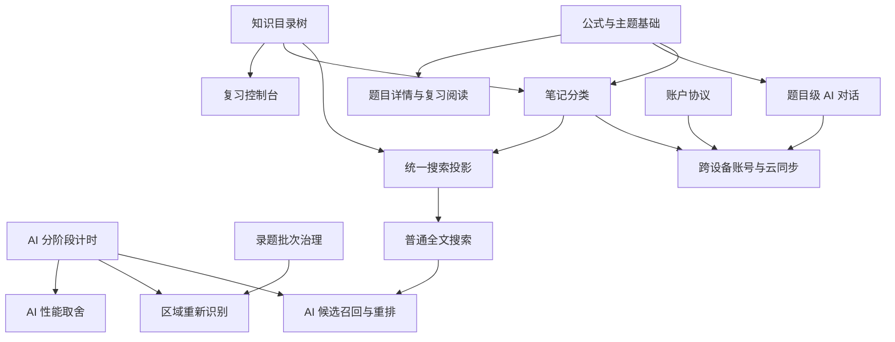

# 研错库产品体验与下一阶段任务规划

> 状态：已确认，按切片执行中  
> 日期：2026-07-23  
> 实施状态：公式渲染、全局主题与录题会话治理切片已完成；下一切片为录题入口和完成页整理
> 关联文档：[09_UI与操作流程重构规划.md](./09_UI与操作流程重构规划.md)

## 0. 本轮结论

这轮不应继续用“看到一个问题就补一个按钮”的方式推进。当前反馈已经跨越渲染、主题、AI 性能、录题会话、题库组织、普通/AI 搜索、复习体系、账户、题目级 AI 对话和笔记系统，适合先建立统一的信息架构，再按依赖顺序逐批实现。

建议采用以下总顺序：

1. 先修影响所有页面的基础问题：公式、主题、录题会话误提示。
2. 再测量并优化 AI 识别链路，同时明确框选区域的真实作用。
3. 重构题库为“知识目录”和“处理中心”两套视角。
4. 建立题库与笔记共用的本地搜索投影，先完成普通搜索，再接 AI 搜索。
5. 补齐复习控制台、复习过程和结果总结。
6. 重构题目详情，并增加题目级 AI 对话。
7. 建立账户外壳和真实登录所需的后端边界。
8. 在稳定的公式、分类、AI 和账户基础上开发独立笔记系统，并接入统一搜索。

这样可以避免在主题、分类树和数据归属尚未稳定时，同时返工复习、聊天和笔记界面。

### 0.1 实施进度

2026-07-23 已完成两个基础切片：

- `BASE-01`：新增显式公式、答案字段裸 LaTeX、中文混排、错误 LaTeX 和安全转义回归样例；
- `FORMULA-01`：公式字段支持保守的裸 LaTeX 识别，历史 AI 数据无需改库即可正常显示；
- `FORMULA-02`：确认页、题目详情和复习页继续共用统一 MathContent 渲染入口；
- 新 AI 录题提示词明确 Markdown 公式定界与 `question_latex` 裸 LaTeX 规则；
- 针对性测试 16 项通过，Windows 端完整测试 101 项通过。

第二个切片：

- `THEME-01`：设置页提供跟随系统、浅色和深色，选择会写入本地偏好并即时应用；
- `THEME-02`：Qt 控件、弹窗、标签页、图片预览与 HTML/MathML 阅读器共用主题令牌；
- 跟随系统模式监听 Qt 系统配色变化，运行中切换系统主题时同步刷新；
- 主题偏好与 AI 偏好保存在同一文件中但互不覆盖；
- 主题与配置针对性测试 23 项通过，Windows 端完整测试 109 项通过。

第三个切片：

- `SESSION-01`：录题主页以真正的待处理批次列表替代“未完成的本次会话”；
- `SESSION-02`：批次区分处理中、等待确认和失败可重试，并支持继续或显式放弃；
- 恢复逻辑不再扫描旧版历史 AI Job，避免已完成题目因残留失败计数被永久误报；
- 没有待确认候选的陈旧 schema v6 会话会自动修复为已完成；
- 放弃批次只关闭未确认候选，不会删除或回滚已经入库的题目；
- Windows 端完整测试 113 项通过。

下一切片：`INTAKE-01`、`INTAKE-02` 与 `REVIEW-01`，调整 AI/手动录题主次顺序、完成页返回路径和复习评分提示。

### 0.2 主题关键页面截图清单

每轮视觉验收至少覆盖浅色、深色两组；“跟随系统”分别在 Windows 浅色和深色下复核：

- 工作台与左侧导航；
- 录题主页、图片上传、AI 确认的阅读/编辑标签页；
- 题库列表、筛选栏和题目详情；
- 今日复习的隐藏答案、显示答案和评分状态；
- 设置对话框、消息框、下拉列表与禁用控件；
- 原图预览及放大查看器；
- 含行内、块级、裸 LaTeX 与失败回退的公式阅读页。

## 1. 当前信息架构建议

一级导航建议调整为：

```text
工作台
录题
题库
复习
笔记
────────
数据与同步
设置

侧栏底部：头像 / 登录 / 账户
```

设计原则：

- AI 是完成录题、问答和笔记提取的能力，不作为独立一级页面。
- 录题、复习、题库浏览分别围绕一个完整用户任务组织。
- 账户入口放在侧栏底部，进入独立账户页面，不挤占高频功能导航。
- “待整理、归档、回收站”是处理状态；“高数、极限、二重积分”是知识分类。两者不再混在同一棵树中。

## 2. 已核实的现状与问题判断

### 2.1 有的公式能渲染，有的不能

这不是随机故障，而是当前渲染规则不完整。

当前渲染器能够识别：

- `$...$`
- `$$...$$`
- `\(...\)`
- `\[...\]`
- 单独存放在 `question_latex` 字段中的公式

但 AI 返回的以下内容没有公式定界符：

```text
A=-\frac{1}{16}
A=-\frac{1}{16},\quad k=2
```

它们分别位于“我的作答”和“正确答案”等字段中，现有渲染器会把它们当成普通文本。题干和解析中的公式带有 `$...$` 或 `$$...$$`，所以能够正常显示。

#### 计划中的修复策略

不采用“把所有包含反斜杠的文本都强制当公式”的粗糙方案，而是建立字段感知的统一渲染规则：

1. `question_latex` 永远按纯 LaTeX 渲染。
2. 题干、解析和一般笔记继续按 Markdown + 显式公式定界符渲染。
3. “我的作答”和“正确答案”使用 `math-or-markdown` 模式：
   - 有显式定界符时按现有规则渲染；
   - 内容明显是裸 LaTeX 表达式时按整段公式渲染；
   - 普通中文说明仍按文本显示。
4. AI 输出约定补充为：Markdown 字段中的公式必须带定界符。
5. 历史数据在显示时兼容，不自动篡改数据库原文。
6. LaTeX 解析失败时保留可读原文，并明确标记“公式无法渲染”，不能出现空白。

#### 验收标准

- 截图中的题干、我的作答、正确答案和解析全部正常显示。
- 行内公式和块公式在确认页、题目详情、复习页、聊天记录和笔记页表现一致。
- 错误 LaTeX 不会使整个页面加载失败。
- 同一份内容在亮色和暗色主题下均可读。

### 2.2 亮暗主题混用

当前配置中已经存在 `theme = "system"`，但程序启动时始终应用固定浅色样式；公式阅读页面也写死为浅色。同时部分原生 Qt 控件没有被统一覆盖，例如确认页顶部标签页会继承系统暗色外观，因此出现“一部分亮、一部分暗”。

#### 目标方案

设置页增加“外观”分组：

- 跟随系统（默认）
- 浅色
- 深色

实现上建立一套主题令牌，而不是维护两份零散样式：

```text
窗口背景
侧栏背景
卡片背景
主文本 / 次文本
边框
强调色
危险色
输入框
选中态
滚动条
公式阅读页背景与公式颜色
```

Qt 控件和 HTML/MathML 阅读器必须使用同一组解析后的主题颜色。需要覆盖的控件至少包括：

- 标签页、菜单、消息框、下拉框
- 输入框、文本框、列表、树、表格
- 滚动条、分隔条、工具提示
- 图片查看器和公式阅读器

“跟随系统”需要在启动时读取系统主题；系统主题在程序运行中改变时，能够刷新应用主题，或者明确提示重启后生效。优先实现即时刷新。

#### 验收标准

- 三种模式可在设置中选择并持久化。
- 默认值为“跟随系统”。
- 切换主题后主窗口、弹窗、公式页面和图片查看器没有混色区域。
- 深色模式下公式、禁用按钮、占位文字和边框仍有足够对比度。

### 2.3 AI 识别耗时

当前不能直接下结论说“增加分类、公式或候选区域导致数量级变慢”，因为程序没有记录请求各阶段的耗时。页面上显示的“保存原图 → 提取题目与公式 → 推荐分类和标签 → 生成待确认表单”是产品阶段说明，不是四次 AI 请求；当前每张图片只调用一次 `/chat/completions`。

对现有任务记录和审计日志的只读检查显示：

- 改造前两次成功请求约为 27.1 秒和 20.7 秒；
- 当前四次正常单题请求约为 24.2、29.6、24.0、24.8 秒，平均约 25.7 秒；
- 正常单题相对前述样本大约增加 7%，不是数量级增长；
- 一次双候选请求约为 45.6 秒，多题和更长输出确实会增加耗时；
- 一条任务表面上持续 1135.1 秒，但审计日志显示它约 17 秒后因 SSL EOF 失败，约 18 分钟后才由用户手动重试成功；这 1135 秒包含人工等待，不能当作一次模型推理耗时。

目前能够确定的新增或潜在开销包括：

- 提示词从早期约 392 字符增长到约 1061 字符，新增了全图多题、区域、科目章节和标签要求；
- 多候选和详细解析会增加输出 token；
- 每次发送完整原图的 Base64，请求体会比原始图片大约增加三分之一；
- 没有单独生成兼顾清晰度的 API 图片副本；
- 图片哈希、复制、候选校验和 SQLite 写入属于本地步骤，当前单图数据不足以证明它们是主要瓶颈；
- 原始响应通常只有约 1 KB，保存原始响应几乎可以忽略。

现有请求还具有以下特征：

- 每张图片单独请求；
- 多张图片目前按顺序处理；
- 临时网络错误最多尝试 3 次；
- 单次配置超时为 120 秒；
- 没有记录连接、上传、首字节、完整响应、JSON 解析和本地入库各自耗时；
- UI 只能看到总体进度，无法知道正在等待哪一步。

#### 第一阶段：只测量，不牺牲准确率

为每个任务和每张图记录：

1. 原图读取与 Base64 编码耗时。
2. 请求体大小。
3. 每次请求尝试的开始、结束和错误类型。
4. 连接及上传耗时（底层能力允许时）。
5. 等待服务返回耗时。
6. 响应大小与 token 使用量。
7. JSON 提取、字段校验和候选生成耗时。
8. 数据库存储耗时。
9. 公式转 MathML 及确认页首次可交互耗时。
10. 自动重试和用户手动重试分别计时，不能再次把中间等待算成单次识别耗时。

UI 进度改为真实阶段：

```text
准备图片 → 上传并识别 → 解析结果 → 建立候选 → 等待确认
```

发生重试时显示“连接中断，正在进行第 2/3 次尝试”，避免用户误以为程序卡死。

#### 第二阶段：根据数据决定取舍

测量后再决定是否采用：

- “标准识别”与“快速识别”两种模式；
- 快速模式只提取题干、公式、科目和区域，答案解析按需补全；
- 标准模式继续一次生成完整题目；
- 多图有限并发，默认上限建议为 2，避免无控制并发；
- 图片尺寸优化，但保留原图，发送副本必须保证公式清晰度；
- 对完全相同的原图和提示词复用已完成结果；
- 针对远端断连设置更清晰的总超时，而不是无限拉长等待；
- 允许用户取消当前请求并保留批次。

默认不能为了速度降低准确率。是否启用快速模式应在真实对照数据出来后决定。

#### 验收标准

- 每次慢任务都能判断时间花在本地、网络、模型还是重试。
- UI 不再长时间停留在含义不明的 100%。
- 取消和失败不会丢失上传批次。
- 优化前后使用同一组样例比较耗时、字段完整率和人工修改次数。

### 2.4 “选择图片”和候选框选的真实作用

“选择图片”本身是必要的，它决定发送给 AI 的原始输入。

但当前确认页中的蓝色框选只会：

- 记录这道候选题在原图中的来源区域；
- 帮助区分同一张图中的多道题；
- 为拆分和合并候选提供几何范围；
- 在确认页高亮当前题目的来源位置。

它目前不会：

- 裁剪图片后重新发送给 AI；
- 重新识别题干；
- 自动改正答案或解析；
- 因为框选改变而更新右侧字段。

因此用户感觉“调整框选没有影响”是正确的。当前界面把“来源标注”做得像“识别范围编辑”，语义过度承诺。

#### 目标方案

把两个行为明确拆开：

1. **来源区域**
   - 蓝框标题改为“题目来源区域”。
   - 辅助文字明确说明：“调整区域只改变原图定位，不会自动重新识别。”
2. **按区域重新识别**
   - 增加明确按钮“按当前区域重新识别”。
   - 点击后才裁剪副本并调用 AI。
   - 新结果进入对比状态，用户选择保留原结果或采用新结果。
   - 显示会产生一次新的 AI 请求。

上传前的裁剪可作为后续增强，但不应强迫用户每张图都手动框选。干净单题图片应当直接识别。

#### 验收标准

- 用户无需猜测框选是否会修改题目内容。
- 未点击重新识别时，调整框选只更新来源定位。
- 点击重新识别后，能够看到请求状态和新旧字段差异。

### 2.5 “未完成的本次会话”误提示

当前数据库中并不是所有会话都已完成：

- 已有多个完成的 AI 录题批次；
- 另有一个较早的批次仍处于 `review` 状态，保留 1 道 `pending` 候选；
- 该候选与后来已入库题目来自同一张原图，标题也高度相似。

当前程序启动时会寻找任意一个历史未完成任务，并直接绑定为“未完成的本次会话”。所以用户完成了最新一次录题后，程序又把更早的遗留候选显示出来。数据库状态和界面文字都不足以表达真实情况。

兼容旧任务的查询还有一个风险：只要旧任务保留 `failed_items > 0`，就可能再次被判断为可恢复任务；查询前没有完整排除已经关联到 `completed/cancelled` intake 会话的 job。

#### 目标方案

将单一卡片改为“待处理录题批次”：

- 显示创建时间、原图缩略图、待确认数量和任务状态；
- 每个批次提供“继续处理”和“放弃批次”；
- 历史批次不再自动绑定为当前页面状态；
- 完成批次永不出现在待处理列表；
- v6 批次以 `IntakeSession` 和实际待处理候选为准，旧任务兼容分支必须排除已经关闭的 intake 会话；
- 同一原图已有未完成批次时，再次识别前提示：
  - 继续原批次；
  - 用新识别替换旧批次；
  - 确认后仍创建新批次。
- 与已入库题目同图且内容高度相似的候选标记为“疑似已入库”，由用户确认关闭，不能静默删除。
- “放弃”使用可审计状态，如 `cancelled` 或 `superseded`，不粗暴删除共享原图。

#### 验收标准

- 完成最新批次后不会突然显示成“本次”的旧任务。
- 用户可以看懂旧任务来自何时、哪张图、还剩几题。
- 用户可以显式关闭不再需要的批次。
- 同图重复识别不会继续堆积无法管理的历史任务。

## 3. 录题流程调整

### 3.1 录题首页

AI 录题是核心入口，手动录题是补充，因此顺序调整为：

```text
AI 录题（主卡片、主按钮）
手动录题（次级卡片）
待处理录题批次
```

AI 卡片应更宽或更突出，并用一句话说明完整流程：

> 上传图片并补充要求，AI 自动提取、分类和整理，确认后直接入库。

这个优先级需要在三个入口保持一致：

- 录题首页：AI 卡片在前并使用主按钮；
- 工作台：AI 录题作为第一入口，手动录题标为补充方式；
- 题库页：主“录题”操作进入 AI 上传，手动录题作为次级菜单或次按钮。

### 3.2 录题完成页

完成页保留清晰的下一步：

- 继续 AI 录题
- 继续手动录题
- 查看刚入库题目
- **返回录题主页**
- 返回工作台

“返回录题主页”不能再与“返回工作台”混为一个按钮。

### 3.3 批次生命周期

统一状态建议为：

```text
draft
processing
review
completed
cancelled
superseded
failed
```

状态显示由“是否有可执行动作”决定：

- `processing`：继续查看进度或取消；
- `review` 且存在待确认候选：继续确认；
- `failed` 且存在可重试项：重试或关闭；
- `completed/cancelled/superseded`：不进入待处理列表。

## 4. 题库：知识树和状态管理分开

用户描述的“高数 → 极限/导数/积分 → 二重积分 → 题目列表”可以称为：

- 层级分类树
- 知识目录树
- 学科—章节树

本项目建议统一称为“知识目录”。

当前数据模型已经支持：

- 科目；
- 章节；
- 章节的 `parent_id`，即子章节。

所以核心数据基础已经存在，当前主要缺少递归服务和树形 UI，不必为了树形结构重新发明一套分类模型。

当前查询还只匹配被选中的单个章节，并不会自动包含子章节；章节管理也缺少移动、循环检测和“父章节必须属于同一科目”的校验。这些需要和树形 UI 一起补齐，不能只把平面列表换成树控件。

### 4.1 题库的两个独立视角

#### A. 浏览题库

只浏览正式题目：

```text
知识目录
├── 高等数学
│   ├── 极限
│   │   ├── 等价无穷小
│   │   └── 泰勒展开
│   ├── 导数
│   └── 积分
│       ├── 定积分
│       └── 二重积分
├── 线性代数
├── 概率论
├── 英语
└── 政治
```

点击中间节点时，题目列表默认显示该节点及所有子节点的题目；点击叶节点时显示该小类题目。列表顶部显示面包屑和数量。

同时保留智能视图：

- 全部正式题目
- 最近入库
- 收藏
- 未分类
- 最近复习

#### B. 处理中心

单独承载生命周期状态：

- 待整理 / 收件箱
- 已归档
- 回收站

不把这些状态节点塞进“高数、线代、概率论”的知识树中。推荐题库页顶部使用：

```text
[浏览题库] [处理中心]
```

进入“浏览题库”看到知识树；进入“处理中心”看到状态队列。这样既保留现有正式题库、待整理和回收站的优点，也不会和知识结构冲突。

### 4.2 分类管理

需要提供：

- 新建、重命名、删除和排序科目；
- 新建、重命名、移动和排序章节；
- 拖动章节改变父级；
- 删除非空分类前选择“移动题目”或“改为未分类”；
- 移动章节时阻止跨科目父子关系和父子循环；
- 可选的考研科目模板，但不强行写死高数、线代等分类；
- AI 推荐只能选择现有分类，或把新分类建议放入待确认状态，不能静默制造近义重复目录。

### 4.3 验收标准

- 至少支持三层以上的章节嵌套。
- 展开和折叠树时不刷新整个题库页面。
- 父节点题目数量包含子节点，并能看出“直接归属”和“包含子级”的区别。
- 搜索结果保留原知识路径。
- 待整理、归档和回收站不再与知识目录同级混排。

## 5. 复习系统重构

当前复习页已经具备“看题 → 显示答案 → 五档评分 → 下一题”的基本闭环，但缺少开始前的控制、过程中的解释和结束后的总结。

目标分成三层。

### 5.1 复习控制台

开始前展示：

- 今日到期题目总数；
- 按科目、章节、标签、优先级和掌握度的数量；
- 最近新增、收藏、需要重做等快捷集合；
- 本次复习题量；
- 顺序：按计划、随机、按知识目录；
- 是否只复习到期题；
- 是否包含手动选中的题。

可视化优先使用简单、稳定、可读的条形图或环形图，不为了“有图”而生成复杂图片。图表必须能回到具体题目列表。

### 5.2 复习过程

界面顺序调整为：

```text
题目
↓
查看答案与解析
↓
提示：查看答案与解析后才能评分
↓
1–5 分评分按钮
↓
上一题 / 暂时跳过 / 下一题
```

要求：

- “查看答案与解析”放在题目下方、评分区上方，不再放在页面右上角。
- 未查看答案前评分按钮禁用。
- 明确显示禁用原因。
- 显示答案后才允许评分。
- 评分后记录并进入下一题。
- 复习完成后不再保留可点击的评分区。
- 可选键盘快捷键，但不能替代可见按钮。

### 5.3 复习结果

完成后展示：

- 本轮题目数和总耗时；
- 1–5 分分布；
- 按科目/章节分布；
- 需要再次复习的题目；
- 与最近一轮相比的变化；
- 查看本轮题目；
- 再来一轮；
- 返回复习主页。

分享和导出建议分两类：

- 分享图片：适合发送复习总结，不包含题目答案和私人笔记；
- 数据表：CSV 或 Markdown，适合个人分析。

在确认格式前，不先做复杂海报编辑器。

### 5.4 数据要求

当前题目只保存累计复习次数和下次复习时间，无法支撑完整历史统计。还有两个需要一起解决的语义问题：

- 当前 `next_review_at = None` 会被当作“现在到期”，无法区分“新题首次待复习”和“用户暂停了复习”；
- “今天”的判断需要按用户本地时区进行，数据库仍保存 UTC，避免中国时区凌晨出现日期偏差。

需要增加 `review_enabled`，并设计独立学习记录。现有 `ReviewSession` 已用于 AI、工作区和同步的“变更审核”，不能复用为学习复习会话，建议使用：

```text
StudySession
- 本轮开始/结束时间
- 选择条件
- 题目数
- 完成状态

StudyRecord
- study_session_id
- problem_id
- 是否查看答案
- 评分
- 作答时间
- 评分时间
- 本次间隔
- 下次复习时间
```

现有累计字段继续保留以便快速展示；从新版本开始记录可靠明细，不尝试从历史普通 Version 中猜测并伪造过去的复习记录。

### 5.5 验收标准

- 用户开始前知道将复习哪些题、多少题。
- 不查看答案不能评分，并能看到原因。
- 完成页与过程中控件状态一致，不出现“题目已完成但仍可评分”。
- 每次评分都有可查询历史。
- 暂停复习后不会因为 `next_review_at` 为空而重新进入今日队列。
- 中国时区日期边界下的到期题数量正确。
- 分享内容默认脱敏。

## 6. 题目详情重构与题目级 AI 对话

### 6.1 原图默认收起

题目已经入库后，详情页的主要任务是阅读题目、答案、解析和笔记，原图不应长期占据左侧大面积空间。

建议改为单列阅读布局：

```text
题目标题    [查看原图]
科目 / 章节 / 标签 / 来源

题目
我的作答
正确答案
解析
错因
个人笔记
```

“查看原图”放在标题或来源信息附近。点击后打开抽屉、浮层或可缩放查看器；关闭后回到原阅读位置。

未点击时不创建 `QPixmap`、不加载大图，也不占用正文宽度。有多张来源资源时，查看器提供上一张/下一张和资源类型；图片缺失时按钮禁用并说明原因。

### 6.2 题目级 AI 对话

在详情页增加“AI 讨论”入口，建议使用右侧抽屉或详情内部标签，不让聊天框默认挤压题目正文。

AI 默认上下文包括：

- 当前题目；
- 正确答案和解析；
- 科目、章节和标签；
- 用户明确选择后才附带原图；
- 用户明确选择后才附带历史已保存对话。

需要支持：

- 针对当前题目连续提问；
- Markdown 与公式渲染；
- 停止生成、重试和复制；
- 显示所用模型及失败原因；
- 对话成本和图片发送提示；
- 删除对话；
- 导出单次对话。

现有 AI Provider 只有一次性图片结构化接口，不能直接承担连续聊天。需要拆分能力边界：

```text
VisionStructureProvider
ChatProvider
ProviderCapabilities
```

`ChatProvider` 首版支持普通文本消息、可选图片上下文、取消、超时以及 usage/cost 元数据；流式输出可以随后增加。设置页也要把“文本模型”和“图片识别模型”分开，不再把两者强制保存为同一模型。

### 6.3 以“对话”为单位保存

推荐行为：

- 当前聊天自动保存在本地临时草稿中，防止关闭页面丢失；
- 用户点击“保存到此题”后，该次对话成为题目的正式子项；
- 用户可以给对话命名；
- 未保存草稿可选择丢弃；
- 一个题目可以有多个独立对话。

概念数据结构：

```text
ProblemConversation
- id
- problem_id
- title
- status: draft / saved
- provider / model
- problem_revision
- context_snapshot_json
- include_original_image
- created_at / updated_at

ProblemMessage
- conversation_id
- sequence
- role
- content_markdown
- status: pending / complete / failed
- created_at
- token/cost metadata
```

聊天记录不能塞进题目的 `notes` 文本字段，也不能与全局聊天混在一起。

用户消息应当先以 `pending` 状态保存到本地，再开始网络请求；即使网络失败，问题和错误状态也不会丢失。题目后续被修改时，旧对话显示“基于题目修订版 N”，不悄悄替换原上下文。

### 6.4 验收标准

- 默认详情页不展示大幅原图。
- 原图可一键查看、缩放和关闭。
- AI 只围绕当前题目建立上下文。
- 保存后重新启动程序仍能从该题目下找到完整对话。
- 删除题目、回收站和永久删除时，对话数据有明确级联规则。

## 7. 登录与账户

当前程序已有本地生成的用户、设备和数据库身份，用于本地数据与同步标识，但没有真实的注册、登录、退出、令牌刷新或账号找回流程。

因此不应先做一个只有输入框、无法连接后端的“假登录页”。

产品上需要明确区分三层身份：

1. 本地资料身份：离线数据空间，现有 `LocalIdentity` 即属于这一层。
2. 云服务连接：GitHub、GitLink 等备份/同步提供商的授权，不等于研错库账号登录。
3. 研错库在线账号：未来有正式身份服务后才提供注册、找回、设备授权和多端会话。

### 7.1 第一阶段：账户页面与离线模式

独立账户页先提供：

- 当前本地身份；
- 显示名称；
- 当前设备；
- 数据目录；
- 已连接的云服务和 AI 凭据状态；
- “登录以同步”入口；
- 明确的离线使用状态。

本地使用不能被登录阻断。未登录用户仍能录题、复习、使用本地笔记和本地保存的 AI 对话。

### 7.2 第二阶段：真实远端登录

实施前必须先确认：

- 账号体系：邮箱、手机号、第三方登录或组合；
- 注册和验证方式；
- 密码重置或验证码登录；
- 服务端 API；
- access token / refresh token 生命周期；
- 多设备数据所有权；
- 本地匿名身份如何绑定远端账号；
- 退出登录后本地数据如何处理；
- 账号删除和数据导出。

密钥和登录令牌必须进入系统凭据存储，不能明文写入普通配置文件。

如果以后支持同一台电脑切换多个本地用户，优先让每个本地资料使用独立数据目录和数据库，通过外层资料列表选择；不在现在就给所有业务表机械增加 `owner_id`。

### 7.3 推荐交互

- 侧栏底部显示头像或“未登录”。
- 点击进入独立账户页。
- 首次登录时提供：
  - 保留本地数据并绑定；
  - 合并云端数据；
  - 发生冲突时进入确认流程。
- 不在启动时强制弹出登录窗口。

## 8. 独立笔记系统

笔记不是“没有答案的题目”，也不是题目的 `notes` 字段扩容。它应当是独立模块，但复用已经稳定的原图存储、公式渲染、知识目录、标签和 AI 任务能力。

### 8.1 用户流程

```text
笔记首页
→ AI 图片录入 / 手动新建
→ 上传书页、标注或手写内容
→ 输入补充要求
→ AI 识别文字、公式、图形和知识点
→ 自动拆成内容块
→ 确认科目、章节和标签
→ 调整块顺序、内容和类型
→ 保存为一篇笔记
```

### 8.2 块式数据模型

建议使用“笔记文档 + 内容块”：

```text
NoteDocument
- 标题
- 科目 / 章节
- 标签
- 来源图片
- 状态

NoteBlock
- sort_order
- type: heading / text / formula / image / callout
- markdown 或 latex 内容
- 来源区域
- 识别置信信息
- AI 不确定字段

NoteAsset
- note_document_id
- role
- sha256 / relative_path
- mime、尺寸和文件大小

NoteTag
- note_document_id
- tag_id
```

一个公式、概念、说明或图片分别成为一个块。多个块按顺序组合成整体笔记。这样既符合用户“一堆框组成整体”的设想，也比把整页 OCR 塞进一个大文本框更容易修改和复用。

笔记和题目可以共用科目、章节、标签与内容寻址对象存储，但不能共用复习状态、作答、答案和错因字段。AI 上传基础设施可以扩展 `IntakeSession.target_type = problem / note`，笔记候选块使用独立暂存表，不能硬塞进题目候选结构。

### 8.3 第一版边界

第一版只做：

- 手动创建和编辑块；
- 图片 AI 提取；
- 公式渲染；
- 调整顺序；
- 科目、章节和标签；
- 阅读模式；
- 原图按需查看。

第一版不做：

- 完整 Word 级排版；
- 多人实时协作；
- 任意画布；
- 自动生成复杂思维导图；
- 题目和笔记之间的大规模自动知识图谱。

后续可以增加“关联题目”和“从题目生成笔记”，但两种实体仍保持独立。

### 8.4 验收标准

- 一张手写公式页可以拆成多个可编辑公式/概念块。
- 块顺序可调整，保存后稳定恢复。
- 笔记使用与题目一致的公式和主题系统。
- AI 判断的科目和标签在保存前可确认。
- 删除笔记不会删除关联题目，反之亦然。

## 9. 题库与笔记库的普通搜索和 AI 搜索

### 9.1 产品目标

题库和笔记库都提供两种可切换模式：

```text
[普通搜索] [AI 搜索]
```

普通搜索解决“我记得题目或笔记中出现过某个词”；AI 搜索解决“我记不住原文，但能描述想找的内容”。

示例：

- 普通搜索：`泰勒展开`
- AI 搜索：`找出需要用泰勒展开，但我当时错在等价无穷小判断上的高数题`
- AI 搜索：`找出关于矩阵秩和线性相关关系的概念笔记`
- AI 搜索：`找出最近两个月没有复习、掌握度较低的积分题`

AI 搜索不能替代普通搜索。默认仍使用免费、快速、离线的普通搜索；只有用户主动切换并提交时才调用 AI。

### 9.2 不直接把整张题库表发给 AI

不建议在每次搜索时导出整张题库表、SQLite 数据库或 Excel 文件并发送给 AI，原因包括：

- 数据量会随着题目和笔记持续增长；
- 每次请求会重复上传大量无关内容；
- token、时间和费用不可控；
- 容易发送不必要的答案、个人笔记和聊天内容；
- CSV 和 Markdown 表格难以稳定表达多行题干、LaTeX、标签数组和层级目录；
- OpenAI 兼容聊天接口接收的是消息文本或图片，并不会自动理解并查询本地 SQLite 数据库。

推荐的原则是：

> 本地数据库负责保存、过滤和召回；AI 只负责理解自然语言意图、对少量候选重新排序并解释匹配原因。

### 9.3 存储结构：同一个 SQLite 中的可重建搜索投影

题目和笔记的正式数据仍然分别保存在 `Problem`、`NoteDocument` 和 `NoteBlock` 等业务表中。搜索不新增第二份“真数据”，而是在同一个 SQLite 数据库中维护可随时重建的搜索投影。

建议结构：

```text
SearchDocument
- id
- entity_type: problem / note
- entity_id
- entity_revision
- lifecycle_status
- title
- subject_id
- chapter_id
- chapter_path_text
- tags_json
- content_text
- metadata_json
- content_hash
- updated_at
```

`content_text` 是面向搜索的统一纯文本，不保存 HTML 或 MathML：

- 题目：标题、题干、LaTeX、题型、标签、科目路径、作答、答案、解析、错因和个人备注；
- 笔记：标题、摘要、科目路径、标签以及按顺序拼接的内容块；
- 公式保留规范化 LaTeX，同时生成适量可读文本，不把渲染后的网页代码写入索引。

这张表只是派生投影：

- 可以删除后重新生成；
- 不能反向覆盖题目或笔记；
- `content_hash` 用于判断内容是否改变；
- `entity_revision` 用于发现漏更新或旧索引。

### 9.4 普通搜索：SQLite FTS5

当前程序只用 `ILIKE '%关键词%'` 搜索少数字段。首版普通搜索建议使用 SQLite FTS5：

```text
SearchFts
- title
- content_text
- chapter_path_text
- tags_text
```

当前 Windows Python 运行时的 SQLite 3.51 已验证支持 FTS5 `trigram` tokenizer，可以搜索“无穷小”这类中文连续片段。实施时仍要在启动测试中检查能力：

- 支持 FTS5 trigram：使用全文索引；
- 打包环境意外不支持：退回当前 `LIKE` 搜索并提示索引能力受限；
- 不引入独立搜索服务器。

普通搜索支持：

- 当前知识节点 / 整个题库；
- 当前笔记目录 / 整个笔记库；
- 标题、正文、标签、来源和公式；
- 与科目、章节、状态、时间、优先级等筛选组合；
- 搜索结果高亮和原知识路径；
- 题库与笔记库分别搜索，后续再增加全局搜索。

### 9.5 索引如何随增删改维护

不能只在“新增题目”时更新索引。以下行为都会影响搜索结果：

- 新增、编辑、确认入库；
- 标签变化；
- 科目或章节变化；
- 章节重命名或移动；
- 题目进入归档、回收站、恢复或永久删除；
- 工作区导入、备份恢复和增量同步；
- 笔记块新增、编辑、删除、合并、拆分和排序；
- 笔记状态、分类和标签变化。

建议建立 `SearchIndexService`：

```text
upsert_problem(problem_id)
upsert_note(note_id)
remove_entity(entity_type, entity_id)
rebuild_all()
verify_and_repair()
```

一致性策略：

1. 业务写入与 `SearchDocument` 更新尽量处于同一数据库事务。
2. FTS 索引跟随 `SearchDocument` 更新，不直接从几十张业务表拼接。
3. 语义向量更新进入持久化后台队列，不阻塞题目入库。
4. 启动时抽查 `entity_revision/content_hash`，发现不一致时修复。
5. 设置页提供“搜索索引状态”和“重建索引”。
6. 批量导入、同步和迁移后按受影响实体增量重建；必要时执行全量重建。
7. 回收站记录保留索引但默认不参与正式库搜索；永久删除才移除投影和向量。

如果某次异常导致索引落后，正式业务数据仍然安全，重建索引即可恢复。

### 9.6 AI 能接受什么格式

对当前 OpenAI 兼容聊天接口，推荐把少量候选以 JSON Lines 作为消息文本发送，而不是发送“数据库文件”：

```jsonl
{"id":"problem_123","type":"problem","title":"等价无穷小确定参数","path":["高等数学","极限","等价无穷小"],"tags":["泰勒展开"],"question":"已知……求 A 与 k","error_analysis":"忽略了二阶项","updated_at":"2026-07-23"}
{"id":"problem_456","type":"problem","title":"洛必达与展开比较","path":["高等数学","极限"],"tags":["洛必达"],"question":"求极限……","error_analysis":"展开阶数不足","updated_at":"2026-07-20"}
```

选择 JSONL 的原因：

- 每行一个独立候选，截断和调试简单；
- 标签和章节路径可以保留数组；
- 多行正文和 LaTeX 比 CSV、Markdown 表格更容易正确转义；
- AI 返回的 ID 可以与本地候选严格核对。

AI 返回格式限定为：

```json
{
  "matches": [
    {
      "id": "problem_123",
      "score": 0.93,
      "reason": "题目需要通过泰勒展开判断等价阶数，且错因与用户描述一致"
    }
  ]
}
```

程序只接受本轮候选集中存在的 ID。AI 不能返回 SQL、不能直接访问数据库，也不能凭空创建不存在的题目结果。

### 9.7 AI 搜索执行链路

推荐采用分层检索：

```text
用户自然语言
→ AI 将意图转换为安全的 SearchSpec
→ 本地执行科目/章节/状态/时间等确定性筛选
→ FTS 或语义索引召回候选
→ 只把少量候选 JSONL 发给 AI 重排
→ 校验返回 ID
→ 展示结果和匹配原因
```

`SearchSpec` 只允许白名单字段，例如：

```json
{
  "entity_type": "problem",
  "keywords": ["泰勒展开", "等价无穷小"],
  "subject": "高等数学",
  "chapter_path": ["极限"],
  "tags": [],
  "priority": {"min": 3},
  "mastery": {"max": 2},
  "updated_before": null,
  "reviewed_before": "2026-05-23",
  "semantic_intent": "错因与等价阶数判断相关"
}
```

AI 只生成受验证的查询规格，不能生成或执行任意 SQL。科目、章节、标签和时间条件由本地服务执行，避免 AI 把明确条件理解错。

首版建议控制：

- 本地初筛最多保留约 50 条；
- 发给 AI 重排的完整候选默认不超过 20 条；
- 使用总字符或 token 预算再次截断，长题目只发送相关摘要；
- 最终默认展示前 10 条；
- 数量均作为配置和基准测试参数，不写死在 UI。

### 9.8 是否需要向量数据库

AI 搜索可以分两阶段：

#### 第一阶段：无向量依赖

- AI 解析用户意图和扩展概念词；
- 本地 FTS 与结构化筛选召回；
- AI 对候选重排和解释。

优点是能使用现有聊天模型，不增加大型本地模型或原生向量依赖。缺点是当用户描述和原文完全没有共同词语时，召回率有限。

#### 第二阶段：语义向量

如果 Faro 或其他提供商稳定支持 embeddings，再增加：

```text
SearchEmbedding
- search_document_id
- provider
- model
- dimensions
- vector_blob
- content_hash
- updated_at
```

内容未改变时不重新计算向量；模型变化时保留模型版本并后台重建。是否采用 `sqlite-vec`、NumPy 本地余弦计算或本地嵌入模型，需要根据以下条件再决定：

- API 是否实际支持 embeddings；
- 题库和笔记规模；
- Windows 打包稳定性；
- 本地模型体积；
- 搜索延迟和准确率基准。

首版不引入独立向量服务器。远端 embeddings 同样会发送文本，不能被误称为“完全本地搜索”。

### 9.9 UI 设计

题库和笔记库搜索框：

```text
[普通搜索 ▼]  输入关键词或描述……  [搜索]
```

普通搜索：

- 输入时短延迟自动搜索；
- 完全离线；
- 不产生 AI 费用。

AI 搜索：

- 用户点击搜索或按 Enter 后才请求；
- 搜索框下显示“AI 将分析搜索意图”；
- 请求前可查看本轮发送范围；
- 结果显示“AI 匹配原因”；
- 支持切换回普通搜索；
- AI 未配置或网络失败时保留查询，并允许退回普通搜索。

搜索范围：

- 当前目录；
- 整个题库 / 整个笔记库；
- 后续可增加“题库 + 笔记”全局范围。

AI 发送字段提供分级选择：

- 默认：标题、题干/笔记正文、科目路径和标签；
- 可选：答案与解析；
- 可选敏感内容：我的作答、错因和个人备注；
- 默认永不发送原图、聊天记录、账户和设备信息。

### 9.10 隐私、成本和可解释性

- AI 搜索按钮旁显示当前提供商和模型。
- 调用前显示预计发送的候选数量和字段范围。
- 日志记录耗时、候选数、token 和费用，不记录完整私人内容。
- 搜索结果必须标注“AI 推荐”，不能伪装成确定匹配。
- 每条结果保留本地匹配路径和 AI 原因。
- 用户可以选择“本次不发送个人作答和备注”。
- AI 搜索历史默认只保存查询文字、筛选条件和结果 ID；是否保存完整 AI 原始响应由隐私设置决定。

### 9.11 验收标准

- 新增、编辑、移动、归档、删除和恢复题目后，搜索结果及时一致。
- 修改任意笔记块后，整篇笔记的搜索投影正确更新。
- 中文片段、标签、章节路径和 LaTeX 可以被普通搜索找到。
- 索引损坏或版本落后时可重建，不影响正式数据。
- AI 搜索不会把整个题库或数据库文件发送出去。
- AI 只能返回本地候选中的 ID。
- AI 未配置、断网或超时时，普通搜索仍然可用。
- 搜索结果能解释“为什么匹配”，并显示其真实知识目录。
- 回收站和永久删除的搜索行为符合当前页面状态。
- 题库和笔记库复用同一搜索服务，但结果类型和入口清晰区分。

## 10. 隐私、备份与同步边界

聊天和笔记会引入比题目更私密的数据，必须在实现前确定边界：

1. AI 密钥和登录令牌只存系统凭据，不进入数据库、日志、备份包或导出包。
2. 题目聊天默认不发送原图；发送前明确显示本轮将发送题干、答案、解析、历史消息和原图中的哪些内容。
3. 后续消息会再次携带历史对话时，需要在输入区说明，并提供清空上下文。
4. 完整 `.ebpack` 会复制完整数据库和资源目录；新增表完成迁移后，聊天和笔记会自然进入完整备份，界面必须提示备份中包含私人内容。
5. 当前增量同步实际主要处理题目，不能因为完整备份可用就宣称聊天和笔记已经支持跨设备增量同步。
6. 后续同步开关应分别控制题目、题目 AI 对话、笔记和原始图片。
7. `.gmshare` 默认永久排除聊天记录、账户信息、设备信息和 AI 原始响应；笔记需要独立导出或由用户明确勾选。
8. 回收站和孤立资源清理必须把 NoteAsset、对话附件和 IntakeAsset 纳入引用检查，不能误删共享哈希文件。
9. 断开账号或云服务只清除令牌和连接状态，不删除本地题库、对话或笔记。

第一阶段聊天和笔记可以只保证本地保存、完整备份与恢复；增量同步在协议和冲突策略完成后单独交付。

## 11. 分批实施计划

所有任务当前均为“待开始”。

### 批次 0：基线与保护

- [x] `BASE-01` 为公式准备固定回归样例。
- [ ] `BASE-02` 为 AI 请求建立分阶段计时与任务诊断记录。
- [ ] `BASE-03` 备份现有 schema v6 数据并增加迁移回滚检查。
- [x] `BASE-04` 建立浅色、深色关键页面截图清单。

完成条件：后续每次改动都能比较公式、耗时、数据和界面，而不是只凭感觉。

### 批次 1：全局阻断问题

- [x] `FORMULA-01` 建立字段感知公式渲染。
- [x] `FORMULA-02` 统一确认页、详情页和复习页渲染入口。
- [x] `THEME-01` 设置中增加跟随系统/浅色/深色。
- [x] `THEME-02` 统一 Qt 与 HTML/MathML 主题。
- [x] `SESSION-01` 将“本次会话”改为待处理批次列表。
- [x] `SESSION-02` 支持继续、放弃和同图重复批次处理。
- [ ] `INTAKE-01` 录题页、工作台和题库页统一为 AI 主入口、手动次入口。
- [ ] `INTAKE-02` 完成页增加“返回录题主页”。
- [ ] `REVIEW-01` 把答案按钮移动到评分区上方并补充禁用说明。

完成条件：用户反馈中的视觉和流程阻断问题全部消失，不引入新功能大改。本批原则上不升级数据库 schema。

### 批次 2：AI 性能与区域语义

- [ ] `PERF-01` 在真实 Faro 请求上收集基线。
- [ ] `PERF-02` 展示真实阶段、重试次数和取消状态。
- [ ] `PERF-03` 根据基线决定快速/标准模式和多图并发。
- [ ] `REGION-01` 将蓝框明确为“题目来源区域”。
- [ ] `REGION-02` 增加“按当前区域重新识别”和新旧结果对比。
- [ ] `CACHE-01` 设计同图同提示结果复用和重复任务提示。

完成条件：用户能够知道为何慢，也能理解框选何时会影响 AI 结果。

### 批次 3：题库知识目录

- [ ] `LIB-01` 递归读取和维护章节树。
- [ ] `LIB-02` 新增“浏览题库 / 处理中心”。
- [ ] `LIB-03` 知识树、面包屑、父节点聚合和未分类节点。
- [ ] `LIB-04` 分类移动、排序、删除保护和 AI 分类约束。
- [ ] `LIB-05` 保留收藏、最近入库等智能视图，并为搜索范围提供知识路径。

完成条件：正式题目按知识结构浏览，生命周期状态在处理中心管理。

### 搜索专项：题库树稳定后启动

- [ ] `SEARCH-01` 建立 SearchDocument 搜索投影和 FTS5 trigram 普通搜索。
- [ ] `SEARCH-02` 建立 SearchIndexService、增删改维护、状态过滤和索引重建。
- [ ] `SEARCH-03` 题库搜索框增加普通/AI 模式及范围选择。
- [ ] `SEARCH-04` 建立白名单 SearchSpec，不允许 AI 生成或执行 SQL。
- [ ] `SEARCH-05` 本地候选召回、JSONL 重排、返回 ID 校验和匹配原因。
- [ ] `SEARCH-06` 增加搜索耗时、token、费用和隐私范围诊断。
- [ ] `SEARCH-07` 笔记模块完成后接入相同索引和两种搜索模式。
- [ ] `SEARCH-08` 根据 Provider 能力和规模基准决定是否增加 embeddings。

完成条件：普通搜索始终离线可用；AI 搜索只接收经过本地初筛的有限候选；新增、修改、回收和永久删除后索引状态正确。

### 批次 4：完整复习体系

- [ ] `REVIEW-02` `review_enabled`、StudySession / StudyRecord 和本地日期边界。
- [ ] `REVIEW-03` 复习控制台和队列条件。
- [ ] `REVIEW-04` 复习过程状态和键盘操作。
- [ ] `REVIEW-05` 完成总结、分布图和题目回看。
- [ ] `REVIEW-06` 脱敏分享图片与数据表导出。

完成条件：复习从“过题工具”升级为可计划、可执行、可复盘的完整模块。

### 批次 5：题目详情与 AI 对话

- [ ] `DETAIL-01` 原图默认收起，按需打开。
- [ ] `DETAIL-02` 单列阅读布局和上下文操作整理。
- [ ] `CHAT-01` ChatProvider、独立文本模型和能力声明。
- [ ] `CHAT-02` 题目级对话与消息数据模型。
- [ ] `CHAT-03` 当前题目上下文、公式显示和原图授权。
- [ ] `CHAT-04` 对话草稿、按对话保存、命名、删除和导出。

完成条件：详情页以题目阅读为中心，AI 对话可持久挂载到具体题目。

### 批次 6：账户

- [ ] `ACCOUNT-01` 独立账户页和离线身份展示。
- [ ] `ACCOUNT-02` 确认远端账号与认证协议。
- [ ] `ACCOUNT-03` 注册、登录、刷新、退出和找回。
- [ ] `ACCOUNT-04` 匿名本地数据绑定与多设备合并。

完成条件：未登录不影响本地使用；登录后数据归属和同步边界清晰。

### 批次 7：笔记 MVP

- [ ] `NOTE-01` NoteDocument / NoteBlock 数据模型。
- [ ] `NOTE-02` 笔记首页、阅读页和块编辑器。
- [ ] `NOTE-03` 图片 AI 提取和确认流程。
- [ ] `NOTE-04` 公式块、概念块、来源区域和原图查看。
- [ ] `NOTE-05` 分类、标签和可选题目关联。
- 搜索能力由搜索专项 SEARCH-07 接入，不在笔记表中另建一套搜索逻辑。

完成条件：手写或印刷内容能通过 AI 转成可编辑的块式笔记，并与错题保持独立。

### 数据迁移原则

- 批次 0、批次 1 和题库树 UI 原则上不升级 schema。
- AI 性能第一版使用结构化日志，先不为埋点扩表。
- SearchDocument、FTS 和可选 SearchEmbedding 使用独立搜索迁移，全部属于可重建派生数据。
- 学习复习记录使用一次独立迁移，不复用变更审核表。
- 题目对话使用一次独立迁移。
- 笔记使用下一次独立迁移，避免把聊天和笔记塞进同一大迁移。
- 每次迁移都必须覆盖旧库启动、重复执行、完整备份恢复和永久删除引用检查。

## 12. 依赖关系



重要约束：

- 公式和主题先于复习、聊天和笔记。
- 性能测量先于模型、提示词和字段取舍。
- 知识目录先于复杂复习筛选和笔记分类。
- 统一搜索投影和普通搜索先于 AI 搜索；AI 不能直接查询正式业务表或执行 SQL。
- 笔记复用题库的搜索服务，只增加 `entity_type=note` 的投影生成器。
- 真实登录依赖服务端协议，但本地聊天和本地笔记不必等待登录。

## 13. 测试与验收矩阵

每个批次至少覆盖：

| 维度 | 必测内容 |
|---|---|
| 主题 | Windows 系统浅色、系统深色、手动浅色、手动深色 |
| 公式 | 行内、块级、裸 LaTeX、中文混排、错误 LaTeX |
| 数据 | 空库、现有 schema v6、迁移后重启、备份恢复 |
| 录题 | 单图单题、单图多题、同图重复、失败重试、取消、旧批次 |
| 题库 | 未分类、三层章节、父节点聚合、归档、回收站 |
| 搜索 | 中文片段、公式、目录、增删改、索引重建、AI ID 校验、离线降级 |
| 复习 | 空队列、单题、多题、跳过、完成、重新进入 |
| 对话 | 草稿、保存、多会话、删除、原图授权、网络失败 |
| 笔记 | 印刷文字、手写文字、公式、混合页面、块排序 |

## 14. 暂不在首批实现的事项

为了控制返工，以下事项先保留设计位，不进入第一批：

- 登录后端和账号注册；
- 复习分享海报编辑器；
- 笔记的 Word 级排版；
- 自动知识图谱；
- 多边形或旋转候选区域；
- 无限制并发 AI 请求；
- 每次 AI 搜索上传整个 SQLite、CSV、Excel 或完整题库；
- 首版引入独立向量服务器；
- 自动把所有旧候选静默删除；
- 为了速度默认丢弃答案、解析或原图质量。

## 15. 需要后续确认的产品选择

以下选择不阻塞批次 0 和批次 1，到了对应批次再确认：

1. 真实账号采用邮箱、手机号还是第三方登录。
2. 复习分享首版只做 PNG，还是同时提供 PNG + CSV/Markdown。
3. 是否提供可选的考研科目分类模板。
4. 性能基线完成后，是否增加“快速识别”模式。
5. 题目 AI 对话采用“自动保留草稿 + 显式保存”，还是所有对话自动永久保存。
6. 笔记首版是否需要题目关联，还是先完成完全独立的笔记闭环。
7. AI 搜索首版是否允许发送答案、错因和个人备注，推荐默认关闭并由用户按次开启。
8. Provider 能力确认后，采用远端 embeddings、本地嵌入模型，还是先只做 FTS + AI 重排。

## 16. 建议的下一步

确认本文后，从“批次 0 + 批次 1”开始，并继续遵守一次只交付一个可验证切片的方式：

1. 先做公式回归样例和字段感知渲染。
2. 验收公式后做全局主题。
3. 再处理旧录题批次误提示。
4. 最后完成 AI 入口顺序、完成页返回和复习按钮位置等小流程调整。

每完成一个切片，先由自动测试和固定样例验证，再交给实际界面测试；确认后才进入下一个切片。
